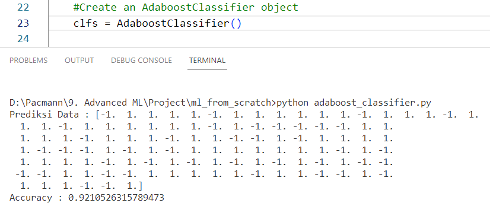
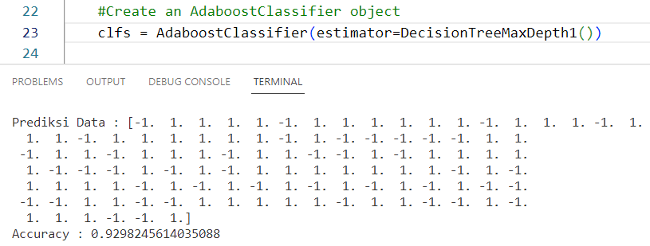
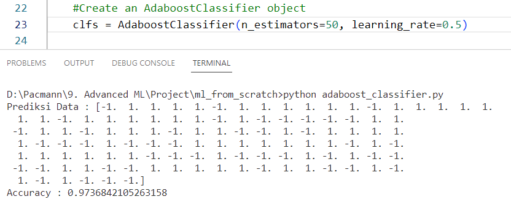
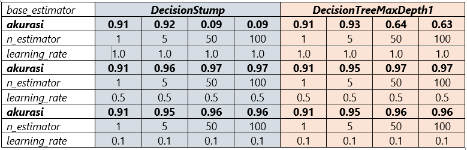

# Implementasi Adaboost dari Scratch

---

AdaBoost adalah algoritma sequential yang meminimalkan batas atas dari kesalahan pengklasifikasian empiris dengan memilih weak klasifikasi dan bobotnya. AdaBoost berfokus meningkatkan kinerja model dengan cara mengurangi kesalahan prediksi. Setiap iterasi AdaBoost, bobot sampel yang salah diklasifikasikan akan ditingkatkan untuk memprioritaskan sampel-sampel yang sulit diklasifikasikan dengan benar oleh model sebelumnya. Dengan meningkatkan bobot pada sampel yang salah diklasifikasikan, model selanjutnya akan lebih fokus pada sampel-sampel yang sulit diklasifikasikan dan berusaha untuk mengurangi kesalahan prediksi tersebut. Maka dari itu, AdaBoost secara iteratif berusaha untuk meminimalkan cost function yang berkaitan dengan kesalahan prediksi pada setiap iterasinya. Optimasi function yang divariasikan adalah bobot sampel dan model parameter.

**1. Bobot sampel**

AdaBoost mendefinisikan distribusi bobot pada sampel data. Bobot-bobot ini diperbarui setiap kali weak learner yang baru ditambahkan, sehingga sampel yang salah diklasifikasikan oleh weak learner diberikan bobot yang lebih besar. Dengan cara ini, sampel yang saat ini salah diklasifikasikan lebih ditekankan selama pemilihan weak learner berikutnya. Maka dari itu, penyesuaian bobot sampel digunakan sebagai strategi optimasi untuk meminimalkan kesalahan prediksi dan meningkatkan akurasi model.

**2. Model Parameter** 

AdaBoost menggunakan model-model lemah (weak learner) sebagai komponen dasar dalam ensemble. Contoh weak learner yang efisien secara komputasi yaitu decision tree, dan decision stump (decision tree dengan satu level pemisahan). Dengan demikian, AdaBoost mengoptimalkan model parameter, yaitu parameter yang digunakan oleh weak learner untuk mengurangi kesalahan prediksi dan meningkatkan akurasi model keseluruhan.

---
**Pseudocode AdaBoost**

Pseudocode melakukan fitting model

▪ Input 
- X : Dataset pelatihan
- y : Label/target dari dataset pelatihan
- n_estimator : jumlah estimator atau model base

▪ Proses
  def fit(X, y):
 - Inisialiasi base estimator, base_estimator = DecisionStump()
 - Dapatkan jumlah sampel dan fitur dalam data latihan
 - Inisialisasi bobot untuk setiap sampel
 - Inisialisasi nilai alpha untuk setiap estimator
 - Lakukan pelatihan untuk setiap estimator (perulangan):
 1. Latih estimator dengan data latih dan bobot saat ini, fit estimator(X, y, weights)
 2. Lakukan prediksi menggunakan estimator yang telah dilatih
 3. Hitung tingkat kesalahan berbobot, errt
 4. Hitung nilai alpha untuk estimator saat ini, αt
 5. Perbarui bobot sampel
6. Tambahkan estimator yang telah dilatih ke dalam list
- Akhir pelatihan

▪ Output
- Model yang telah dilatih dengan estimator
- Nilai alpha αt

Pseudocode melakukan prediction

▪ Input 
- X : sampel input untuk melakukan prediksi

▪ Proses 
def predict(X):
- Inisialisasi label yang diprediksi
- Iterasi setiap estimator dalam ensemble
 1. Lakukan prediksi menggunakan estimator saat ini.
2. Tambahkan prediksi ke dalam prediksi keseluruhan.
- Ubah prediksi menjadi label biner, y_pred = sign(y_pred)
- Kembalikan label yang diprediksi

▪ Output
 - y_pred (prediksi akhir) – prediksi kelas

---
Untuk meningkatkan performa model dilakukan eksperimen pada beberapa hyperparameter seperti base_estimator, n_estimators, dan learning_rate.

**Tanpa Parameter (default n_estimators=5, learning_rate=1.0, estimator=DecisionStump())**

**Hyperparameter (n_estimators=5, learning_rate=1.0, estimator=DecisionTreeMaxDepth1())**

**Hyperparameter Terbaik (n_estimators=50, learning_rate=0.5, estimator=DecisionStump())**

**Hasil Beberapa Hyperparameter Secara Keseluruhan**

